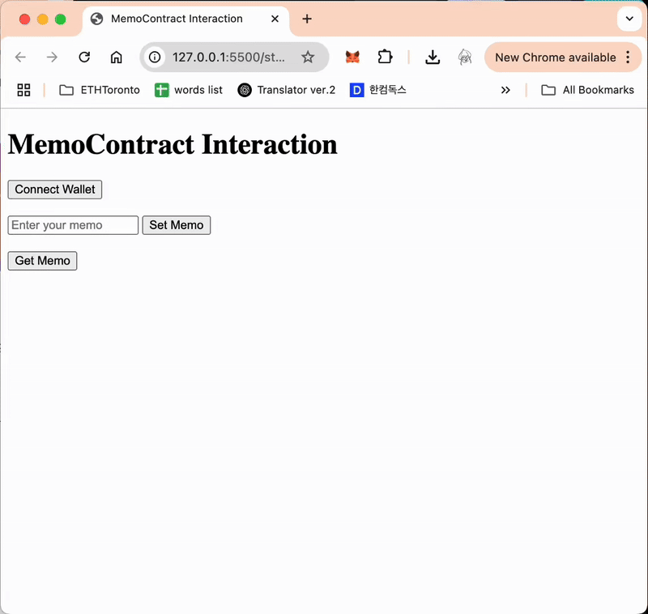

# 📝 Day 05: Smart Contract Deployment & Verification

<br>



<br>

## 1. Writing the Smart Contract
I wrote a simple **MemoContract** that allows storing and retrieving a memo.

```solidity
// SPDX-License-Identifier: MIT
pragma solidity ^0.8.21;

contract MemoContract {
    string public memo;

    function setMemo(string calldata _memo) public {
        memo = _memo;
    }

    function getMemo() public view returns (string memory) {
        return memo;
    }
}
```

---
<br>

## 2. Setting Up the Development Environment (Foundry + Local Solc)

Due to network restrictions, I downloaded the **Solidity compiler (solc)** locally and configured Foundry to use it.

1. Download **solc-macos** binary from [Solidity GitHub (v0.8.21)](https://github.com/ethereum/solidity/releases/tag/v0.8.21).
2. Create a `solc-bin/` directory in the project and save the binary.
3. Grant execution permission:

```bash
chmod +x solc-bin/solc-macos
```

4. Modify **foundry.toml** to configure the local solc path:

```toml
[profile.default]
src = "src"
out = "out"
libs = ["lib"]

solc-version = "0.8.21"
solc = "./solc-bin/solc-macos"
```

---
<br>

## 3. Compiling the Smart Contract

```bash
forge build
```

- This compiles the Solidity code to **EVM bytecode** using **solc 0.8.21**.

---
<br>

## 4. Sepolia Network Configuration (Testnet)

- Obtain a **Sepolia RPC URL** from [Infura](https://infura.io/).
- Acquire **Sepolia test ETH** via MetaMask faucet.
- Store environment variables in a **.env** file:

```
SEPOLIA_RPC_URL=https://sepolia.infura.io/v3/PROJECT_ID
PRIVATE_KEY=YOUR_PRIVATE_KEY
```

- Add `.env` to **.gitignore** to prevent committing sensitive information.

---
<br>

## 5. Writing the Deployment Script (Foundry Script)

Create **script/Deploy.s.sol** for deploying the contract:

```solidity
// SPDX-License-Identifier: MIT
pragma solidity ^0.8.21;

import {Script} from "forge-std/Script.sol";
import {MemoContract} from "../src/MemoContract.sol";

contract DeployMemo is Script {
    function run() external {
        vm.startBroadcast();
        new MemoContract();
        vm.stopBroadcast();
    }
}
```

---
<br>

## 6. Deploying the Smart Contract (Sepolia Testnet)

```bash
forge script script/Deploy.s.sol:DeployMemo --rpc-url $SEPOLIA_RPC_URL --private-key $PRIVATE_KEY --broadcast
```

- Deployment successful!
- **Transaction Hash** and **Contract Address**:

```
Tx Hash: 0x45d0cb17ed515aab6109e48fee1f40f1c7335a21e2d6d5274752cff722eca162  
Contract Address: 0x0C447f6c10198532A6570673d10467F4eC7Ebd28
```

---
<br>

## 7. Verifying the Smart Contract (Etherscan Verification)

```bash
forge verify-contract --chain sepolia 0x0C447f6c10198532A6570673d10467F4eC7Ebd28 src/MemoContract.sol:MemoContract --etherscan-api-key YOUR_API_KEY
```

- Verified successfully on [Etherscan (Sepolia)](https://sepolia.etherscan.io/address/0x0C447f6c10198532A6570673d10467F4eC7Ebd28).

---
<br>

## 8️. Frontend Integration (ethers.js)

A simple **HTML + ethers.js** frontend was implemented to interact with the deployed contract.

### Sample Code (index.html):

```html
<script src="https://cdn.jsdelivr.net/npm/ethers@5.7.2/dist/ethers.umd.min.js"></script>
<script>
  const contractAddress = "0x0C447f6c10198532A6570673d10467F4eC7Ebd28";
  const abi = [
    "function setMemo(string _memo) public",
    "function getMemo() public view returns (string)"
  ];

  let provider, signer, contract;

  async function connectWallet() {
    provider = new ethers.providers.Web3Provider(window.ethereum);
    await provider.send("eth_requestAccounts", []);
    signer = provider.getSigner();
    contract = new ethers.Contract(contractAddress, abi, signer);
  }

  async function setMemo() {
    const memo = document.getElementById("memoInput").value;
    const tx = await contract.setMemo(memo);
    await tx.wait();
  }

  async function getMemo() {
    const memo = await contract.getMemo();
    document.getElementById("memoOutput").innerText = memo;
  }
</script>
```

- Functions:  
  - **Connect Wallet (MetaMask)**  
  - **Set Memo (Transaction)**  
  - **Get Memo (Free read)**

---
<br>
<br>
<br>

# 💾 Reflection

This was my first time building a program using blockchain technology.
When I was just studying the theory, I understood Ethereum as a blockchain platform that not only facilitates currency exchange but also executes code (smart contracts).

However, after actually creating a transaction using test ETH and deploying a smart contract, I really felt the weight of coding something that interacts with real assets.
The fact that once deployed, a smart contract cannot be undone was both fascinating and intimidating.
I was especially surprised when Remix displayed a warning that a simple mistake in my code could potentially cause me to lose all the funds in my wallet.

Previously, I thought the biggest difference between hardware/embedded development and software development was the severity of mistakes.
But now, I realize that blockchain development, especially when handling real assets, requires the same level of caution and attention as working with hardware.

At this point, I don’t have any specific ideas for what I want to build with blockchain,
but I feel excited that, as I explore more examples, I’ll eventually come up with an idea that truly leverages the unique characteristics of blockchain technology—and I can’t wait to bring it to life.